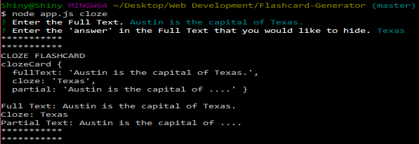

# Flashcard-Generator
**Description:** A node application that can generate basic flashcards and cloze deletion flashcards.

**Flash Card Information**
In this application, there are two kinds of flashcards that can be created: **Basic Flashcards** and **Cloze Deletion Flashcards**

**Basic Flashcards**
A basic flashcard is just a flashcard with a front and a back. A description or a question is usually written in the front while the answer to the description/question is written in the back.

**Cloze Deletion Flashcards**
A cloze deletion flashcard is essentially like a basic flashcard (it has a front and a back), but the card is written in a way where users have to fill in the blanks. On the front, there is a statement with a hidden word. The back shows what should be the hidden word.
  * Example:
     * Front: ... is the capital of Texas.
     * Back: Austin

## How the App Works
In this app, a user will create a flashcard using the command line.

To create a Basic Flashcard, type:
`node app.js basic`
Once that is entered into the command line, users will be prompted to input the front and the back of the flashcard. Afterwards, the flashcard will be console logged.

To create a Cloze Flashcard, type:
`node app.js cloze`
Once that is entered into the command line, users will be prompted to input the front and the back of the flashcard. Afterwards, the flashcard will be console logged.

